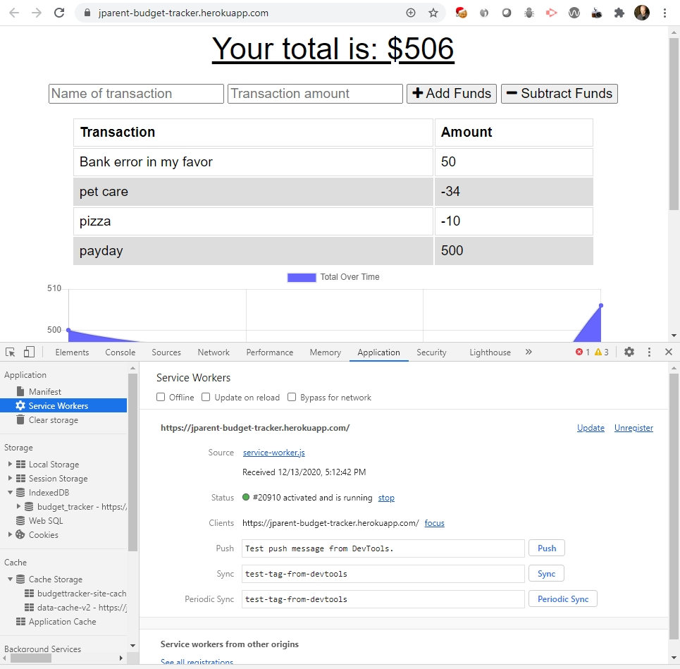
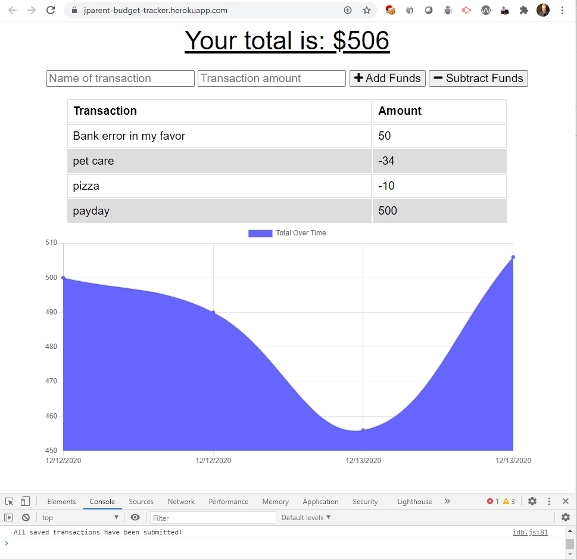
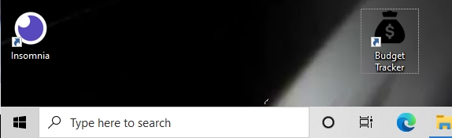

# Budget Tracker

## Description

A Javascript and NodeJS application that tracks budget values in MongoDB. This uses indexedDB and service worker to provide offline functionality and PWS installation.

## Table of Contents

- [Installation](#installation)
- [Usage](#usage)
- [License](#license)
- [Deployed Application](#deployed-application)
- [Contributing](#contributing)
- [Tests](#tests)
- [Questions](#questions)
- [Screenshots](#screenshots)

## Installation

npm install

## Usage

This will allow users to view and create transactions against a budget. If the application goes offline, transactions will be stored in local IndexedDb store until the browser detects that it is back online. If the user refreshes their browser while offline, the application will render and show data stored in the cache storage.

## License

This project uses The MIT License

## Deployed Application

The deployed application can be found at https://jparent-budget-tracker.herokuapp.com/

## Contributing

Feel free to contact me over email if you have some great ideas

## Tests

Test manually

## Questions

Feel free to contact the developer at jesse@parent.com about contributing to https://github.com/jesseparent

## Screenshots

Service worker, IndexedDB store, and cache storage for app and data: 

Offline data being used to submit transactions to the server after the browser is back online: 

Desktop icon for installed Budget Tracker PWA: 
